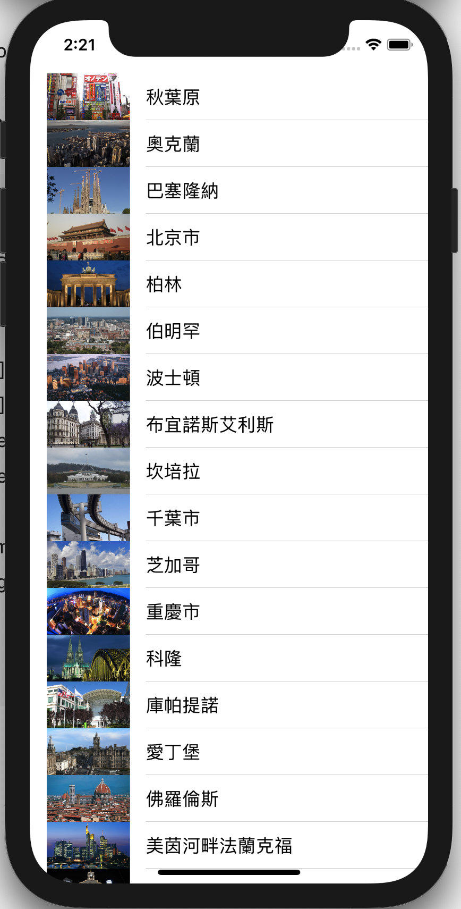

# 第10堂課建立以表格為基礎的App



## 解析citylist.plist檔內的資料

1. 將資源檔內的citylist.plist加入至專案中
2. 將資源檔內的cityImage資料夾內的圖片加入至Assets內
3. 解析citylist.plist內的資料，將資料儲存至屬性cityies內

```swift
import UIKit

class ViewController: UIViewController {
    var cities:[[String:Any]]!;
    
    override func viewDidLoad() {
        super.viewDidLoad()
        //利用Bundle.main載入取出citylist.plist在Bundle檔內的絕對路徑
        let bundle = Bundle.main;
        guard let pathURL = bundle.url(forResource: "citylist", withExtension: "plist") else{
            print("沒有發現些檔案")
            return
        }
        //使用NSArray解析citylist.plist內的內容，並將轉換為List的型別
        cities = NSArray(contentsOf: pathURL) as? [[String:Any]]
        
        //使用取出list內的Dictionary物件
        for city in cities{
            print(city)
        }        
        
    }


}
```

## 建立UITableView

1. 在storyboard內加入tableView，並建立接口cityTableView

```swift
@IBOutlet var cityTableView:UITableView!;
```

2. 設定cityTableView的dataSource為ViewController

```swift
cityTableView.dataSource = self;
```

```swift
class ViewController: UIViewController {
    @IBOutlet var cityTableView:UITableView!
    var cities:[[String:Any]]!
    
    override func viewDidLoad() {
        super.viewDidLoad()
        //利用Bundle.main載入Bundle內的citylist.plist
        let bundle = Bundle.main;
        guard let pathURL = bundle.url(forResource: "citylist", withExtension: "plist") else{
            print("沒有發現些檔案")
            return
        }
        
        cities = NSArray(contentsOf: pathURL) as? [[String:Any]]
        
        cityTableView.dataSource = self;
        
    }
}
```

## 建立UITableView要顯示的資料

1. ViewController 採納 UITableViewDataSource protocol

```swift
class ViewController: UIViewController,UITableViewDataSource{
}
```

2. 實作UITableViewDataSource Protocol 內必要的2個method
	- func tableView(_ tableView: UITableView, 
numberOfRowsInSection section: Int) -> Int

	- func tableView(_ tableView: UITableView, 
  cellForRowAt indexPath: IndexPath) -> UITableViewCell
  
 ```swift
 func tableView(_ tableView: UITableView,
                   numberOfRowsInSection section: Int) -> Int{
        
    }
    
    func tableView(_ tableView: UITableView,
                   cellForRowAt indexPath: IndexPath) -> UITableViewCell{
        
    }
 ``` 
 
 
3. 告知tableView我們需要顯示的Row的數量

```swift
func tableView(_ tableView: UITableView,
                   numberOfRowsInSection section: Int) -> Int{
        return cities.count
    }
```

## 產生UITableViewCell

1. 將storyboard內的UITableView新增一個Prototype Cell,並將cell的identifier改為CELL
2. 取出cities內的資料，並建立UITableViewCell，將資料加入至cell內

```swift
   func tableView(_ tableView: UITableView,
                   cellForRowAt indexPath: IndexPath) -> UITableViewCell{
        let rowIndex = indexPath.row
        let city = cities[rowIndex]
        let cell = tableView.dequeueReusableCell(withIdentifier: "CELL", for: indexPath)
        let cityName = city["City"] as? String
        let country = city["Country"] as? String
        let imageName = city["Image"] as? String ?? ""
        
        if #available(iOS 15, *) {
            //ios15以上使用這個程式區段
            //使用新的寫法
            var content = cell.defaultContentConfiguration()
            content.text = cityName
            content.secondaryText = country
            content.image = UIImage(named: imageName)
            content.imageProperties.reservedLayoutSize = CGSize(width: 80, height: 50)
            cell.contentConfiguration = content
            
        }else{
            //ios14以下的
            cell.textLabel!.text = cityName
            cell.detailTextLabel!.text = country
            cell.imageView!.image = UIImage(named: imageName)
        }
        
        print("傳出UITableViewCell")
        
        return cell
    }
```

## ViewController.swift內容

```swift
//
//  ViewController.swift
//  lesson5_1
//
//  Created by 徐國堂 on 2021/4/18.
//

import UIKit

class ViewController: UIViewController,UITableViewDataSource {
    @IBOutlet var tableView:UITableView!
    
    var cities:[[String:Any]]!
    
    override func awakeFromNib() {
        super.awakeFromNib()
        /*
        let bundle = Bundle.main
        let url = bundle.url(forResource: "citylist", withExtension: "plist")!
        print(url.path)
        
        let array = NSArray(contentsOf: url)!
        let swiftArray = array as! [[String:Any]]
        for item in swiftArray{
            let cityName = item["City"] as! String
            print(cityName)
        }
 */
        
        if let url = Bundle.main.url(forResource: "citylist", withExtension: "plist"){
            if let citys = NSArray(contentsOf: url) as? [[String:Any]]{
                cities = citys
            }
            
        }
        
        
    }

    override func viewDidLoad() {
        super.viewDidLoad()
        tableView.dataSource = self
    }
    
    func tableView(_ tableView: UITableView,
                   numberOfRowsInSection section: Int) -> Int{
        return cities.count
    }
    
    
    func tableView(_ tableView: UITableView,
                   cellForRowAt indexPath: IndexPath) -> UITableViewCell{
        let rowIndex = indexPath.row
        let city = cities[rowIndex]
        let cell = tableView.dequeueReusableCell(withIdentifier: "CELL", for: indexPath)
        let cityName = city["City"] as? String
        let country = city["Country"] as? String
        let imageName = city["Image"] as? String ?? ""
        
        if #available(iOS 15, *) {
            //ios15以上使用這個程式區段
            //使用新的寫法
            var content = cell.defaultContentConfiguration()
            content.text = cityName
            content.secondaryText = country
            content.image = UIImage(named: imageName)
            content.imageProperties.reservedLayoutSize = CGSize(width: 80, height: 50)
            cell.contentConfiguration = content
            
        }else{
            //ios14以下的
            cell.textLabel!.text = cityName
            cell.detailTextLabel!.text = country
            cell.imageView!.image = UIImage(named: imageName)
        }
        
        print("傳出UITableViewCell")
        
        return cell
    }
    
    
    


}


```


