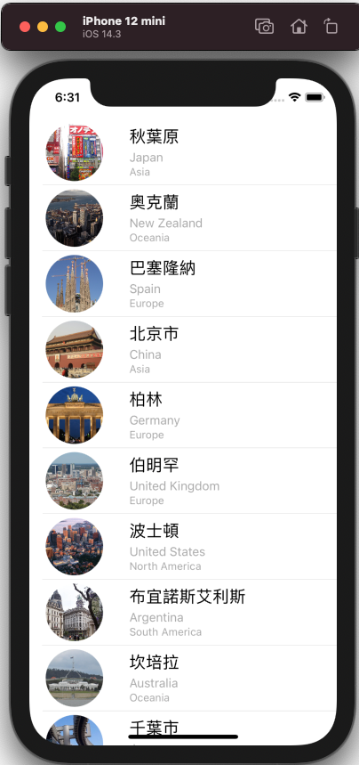
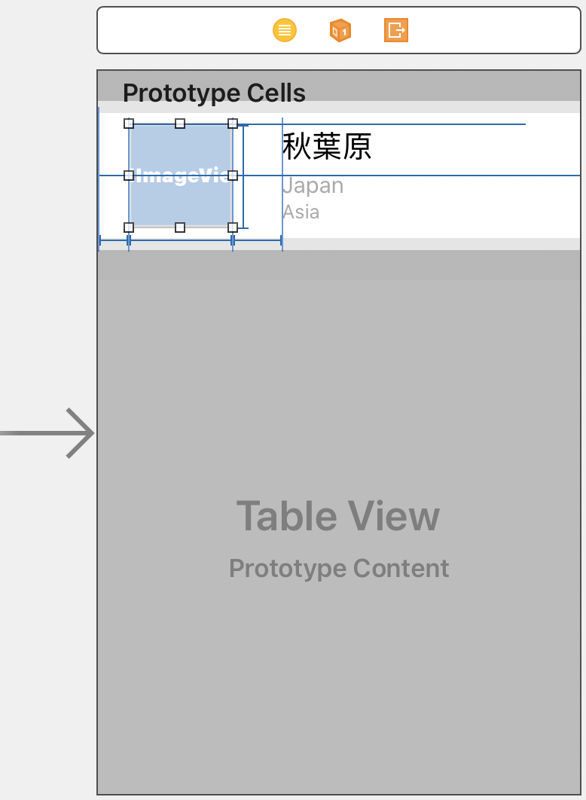

# 第11堂課使用原型儲存格建立自訂的TableView
## 完成樣式


##  重新建立相同的App使用UITableViewControllert取代UIViewController

```swift
class ViewController: UITableViewController {
	...
}
```


- cell內的圖片，使用不同的形狀取代
## 設計一個自訂的tableViewCell來取代預設的tableViewCell



### 如何自訂UITableViewCell
- 改變Cell的高度
- 建立UIImageView和3個UILable
- 使用stackView和constraints建立layout
- 顯示圓形的圖片