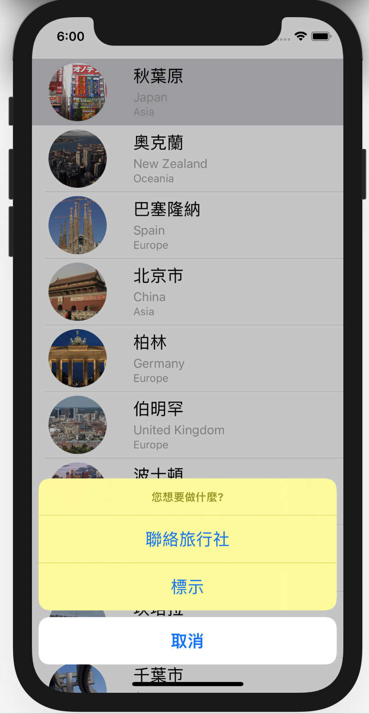
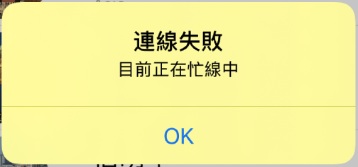

# 第13堂課使用UIAlertController和使用者互動
## 完成樣式



## UIAlertController
1. 實作 `func tableView(_ tableView: UITableView, didSelectRowAt indexPath: IndexPath)`
 
1. 使用UIAlertController
2. 建立UIAlertAction

```swift
//
//  ViewController.swift
//  simpleTableView
//
//  Created by t1 on 2019/1/20.
//  Copyright © 2019年 gjun. All rights reserved.
//

import UIKit

class ViewController: UITableViewController {
    
    var citys:[[String:Any]]!;
    var cityIsMarded:[Bool]!;
    
    override func viewDidLoad() {
        super.viewDidLoad()
        let bundle = Bundle.main;
        let pathURL = bundle.url(forResource: "citylist", withExtension: "plist")!;
        citys = NSArray(contentsOf: pathURL) as? [[String:Any]];
        cityIsMarded = Array(repeating: false, count: citys.count);
        
    }
    //MARK: - UITableViewDataSource
    override func tableView(_ tableView: UITableView, numberOfRowsInSection section: Int) -> Int{
        return citys.count;
    }
    
    override func tableView(_ tableView: UITableView, cellForRowAt indexPath: IndexPath) -> UITableViewCell{
        let rowIndex = indexPath.row;
        let cityDic = citys[rowIndex];
        let cityName = cityDic["City"] as? String;
        let imageName = cityDic["Image"] as? String;
        let countryName = cityDic["Country"] as? String;
        let continentName = cityDic["Continent"] as? String;
        let cell = tableView.dequeueReusableCell(withIdentifier: "CELL", for: indexPath) as! CityCell;
        cell.cityLabel.text = cityName;
        cell.countryLabel.text = countryName;
        cell.continentLabel.text = continentName;
        cell.cityImageView.image = UIImage(named: imageName!);
        if cityIsMarded[rowIndex]{
            cell.accessoryType = .checkmark;
        }else{
            cell.accessoryType = .none;
        }
        return cell;
    }

    //MARK: - UITableViewDelegate
    override func tableView(_ tableView: UITableView, didSelectRowAt indexPath: IndexPath){
        //建立一個action sheet的選項按鈕
        let optionMenu = UIAlertController(title: nil, message: "您想要做什麼?", preferredStyle: .actionSheet);
        //在action sheet內建立一個按鈕
        let cancelAction = UIAlertAction(title: "取消", style: .cancel, handler: nil);
        optionMenu.addAction(cancelAction);
        
        //在actionSheet內建立一個call-action
        let callAction = UIAlertAction(title: "聯絡旅行社", style: .default, handler: {
            (action:UIAlertAction!)->Void in
            let alertMessage = UIAlertController(title: "連線失敗", message: "目前正在忙線中", preferredStyle: .alert);
            alertMessage.addAction(UIAlertAction(title: "OK", style: .default, handler: nil));
            self.present(alertMessage, animated: true, completion: nil);
        })
        
        optionMenu.addAction(callAction);
        
        //增加標示選項
        var titleName:String!;
        if self.cityIsMarded[indexPath.row]{
            titleName = "取消標示"
        }else{
            titleName = "標示"
        }
        
        let checkInMark = UIAlertAction(title: titleName, style: .default, handler: {
            (action:UIAlertAction) -> Void in
            let cell = tableView.cellForRow(at: indexPath);
            switch titleName{
            case "取消標示":
                cell?.accessoryType = .none;
                self.cityIsMarded[indexPath.row] = false;
            case "標示":
                cell?.accessoryType = .checkmark
                self.cityIsMarded[indexPath.row] = true;
            default:
                break;
            }
            
        })
        
        optionMenu.addAction(checkInMark);
        
        //顯示選項
        present(optionMenu, animated: true, completion: nil);
    }
}


```

### .actionsheet


### .alert

