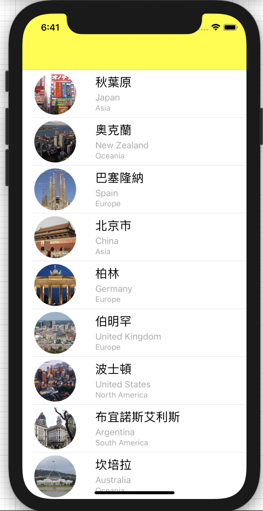

# 使用導覽控制

- 了解storyboard和segue
- 建立NavigationController
- 增加一個detailViewController
- 為DetailViewController建立一個新的Class
- 在自訂class增加變數
- 使用segues傳遞資料

```swift
//
//  ViewController.swift
//  simpleTableView
//
//  Created by t1 on 2019/1/20.
//  Copyright © 2019年 gjun. All rights reserved.
//

import UIKit

class ViewController: UITableViewController {
    
    var citys:[[String:Any]]!;
    var cityIsMarded:[Bool]!;
    
    override func viewDidLoad() {
        super.viewDidLoad()
        let bundle = Bundle.main;
        let pathURL = bundle.url(forResource: "citylist", withExtension: "plist")!;
        citys = NSArray(contentsOf: pathURL) as? [[String:Any]];
        cityIsMarded = Array(repeating: false, count: citys.count);
        
    }
    
    override func prepare(for segue: UIStoryboardSegue, sender: Any?) {
        if segue.identifier == "showCity"{
            if let indexPath = tableView.indexPathForSelectedRow{
                let destinationController = segue.destination as! CityDetailViewController;
                let city = citys[indexPath.row];
                destinationController.cityImageName = city["Image"] as? String;
                destinationController.cityName = city["City"] as? String;
            }
        }
    }
    extension ViewController:UITableViewDataSource{
    func tableView(_ tableView: UITableView,
                   numberOfRowsInSection section: Int) -> Int{
        return cities.count
    }
    
    func tableView(_ tableView: UITableView,
                   cellForRowAt indexPath: IndexPath) -> UITableViewCell{
        let rowIndex = indexPath.row
        let city = cities[rowIndex]
        var cell:CityCell!
        cell = tableView.dequeueReusableCell(withIdentifier: "MYCELL", for: indexPath) as? CityCell
       
        //image
        let imageName = city["Image"] as! String
        cell.cityImageView.image = UIImage(named: imageName)
        cell.cityImageView.layer.cornerRadius = 40.0
        //cell.cityImageView.layer.masksToBounds = true;
        
        //cityname
        
        cell.cityLabel.text = city["City"] as? String
        cell.countryLabel.text = city["Country"] as? String
        cell.continentLabel.text = city["Continent"] as? String
        if cityIsMarked[rowIndex]{
            cell.accessoryType = .checkmark
        }else{
            cell.accessoryType = .none
        }
        return cell;
        
    }
    
    func tableView(_ tableView: UITableView,
                     commit editingStyle: UITableViewCell.EditingStyle,
                     forRowAt indexPath: IndexPath){
        //刪除tableView的row
        if editingStyle == .delete {
            cities.remove(at: indexPath.row)
            cityIsMarked.remove(at: indexPath.row)
            print("現在剩下的資料還有\(cities.count)")
            tableView.deleteRows(at: [indexPath], with: .automatic)
        }
    }
    
}

extension ViewController:UITableViewDelegate{
    
    func tableView(_ tableView: UITableView,
                   didSelectRowAt indexPath: IndexPath){
        performSegue(withIdentifier: "goDetail", sender: self)
        /*
        let optionMenu = UIAlertController(title: nil, message: "您想要做什麼?", preferredStyle:.actionSheet)
        
        let cancelAction = UIAlertAction(title: "取消", style: .default, handler: nil)
        
        optionMenu.addAction(cancelAction)
        
        
        //在actionSheet內，再加入一個UIAlertAction
        let callAction = UIAlertAction(title: "聯絡旅行社", style: .default){(action:UIAlertAction) -> Void in
            let alertMessage = UIAlertController(title: "連線失敗", message: "目前正在忙線中", preferredStyle: .alert)
            alertMessage.addAction(UIAlertAction(title: "OK", style: .default, handler: nil))
            self.present(alertMessage, animated: true, completion: nil)
        }
        
        optionMenu.addAction(callAction)
        
        //增加標示選項
        var titleName:String!;
        if self.cityIsMarked[indexPath.row]{
            titleName = "取消標示"
        }else{
            titleName = "標示"
        }
        
        let chekInMark = UIAlertAction(title: titleName, style: .default){
            (action:UIAlertAction) -> Void in
            let cell = tableView.cellForRow(at: indexPath)
            switch titleName{
            case "取消標示":
                cell?.accessoryType = .none
                self.cityIsMarked[indexPath.row] = false;
            case "標示":
                cell?.accessoryType = .checkmark
                self.cityIsMarked[indexPath.row] = true;
            default:
                break
            }
            
        }
        
        optionMenu.addAction(chekInMark)
        
        self.present(optionMenu, animated: true, completion: nil)
     */
    }
 
    
    @available(iOS 8.0, *)
    func tableView(_ tableView: UITableView,
                   editActionsForRowAt indexPath: IndexPath) -> [UITableViewRowAction]?{
        let shareAction = UITableViewRowAction(style: .default, title: "分享") { (action:UITableViewRowAction, indexPath:IndexPath) in
            print("share")
        }
        
        let deleteAction = UITableViewRowAction(style: .default, title: "刪除") { (action:UITableViewRowAction, indexPath:IndexPath) in
            
            self.cities.remove(at: indexPath.row)
            self.cityIsMarked.remove(at: indexPath.row)
            print("現在剩下的資料還有\(self.cities.count)")
            tableView.deleteRows(at: [indexPath], with: .automatic)
            
        }
        
        shareAction.backgroundColor = UIColor(red: 48.0/255, green: 173.0/255.0, blue: 99.0/255.0, alpha: 1.0)
        deleteAction.backgroundColor = UIColor(red: 202.0/255, green: 202.0/255.0, blue: 202.0/255.0, alpha: 1.0)
        return [shareAction, deleteAction]
    }
    
    @available(iOS 11.0, *)
    func tableView(_ tableView: UITableView,
                   trailingSwipeActionsConfigurationForRowAt indexPath: IndexPath) -> UISwipeActionsConfiguration?{
        let shareAction = UIContextualAction(style: .normal, title: "分享") { (action:UIContextualAction, view:UIView, completionHandler:(Bool) -> Void) in
            print("分享")
            completionHandler(true)
        }
        
        let deleteAction = UIContextualAction(style: .normal, title: "刪除") { (atcion:UIContextualAction, view:UIView, completionHandler:(Bool) -> Void) in
            
            self.cities.remove(at: indexPath.row)
            self.cityIsMarked.remove(at: indexPath.row)
            print("現在剩下的資料還有\(self.cities.count)")
            tableView.deleteRows(at: [indexPath], with: .automatic)
            completionHandler(true)
            
        }
        
        shareAction.backgroundColor = UIColor(red: 48.0/255, green: 173.0/255.0, blue: 99.0/255.0, alpha: 1.0)
        deleteAction.backgroundColor = UIColor(red: 202.0/255, green: 202.0/255.0, blue: 202.0/255.0, alpha: 1.0)
        
        return UISwipeActionsConfiguration(actions: [shareAction,deleteAction])
    }
    
    
}

```

```swift
//
//  CityDetailViewController.swift
//  Navigation
//
//  Created by Robert on 2019/2/6.
//  Copyright © 2019 gjun. All rights reserved.
//

import UIKit

class CityDetailViewController: UIViewController {
    @IBOutlet var cityImageView:UIImageView!;
    var cityImageName:String?;
    var cityName:String?;
    override func viewDidLoad() {
        super.viewDidLoad()

        cityImageView.image = UIImage(named: cityImageName ?? "");
        title = cityName;
    }
    

    /*
    // MARK: - Navigation

    // In a storyboard-based application, you will often want to do a little preparation before navigation
    override func prepare(for segue: UIStoryboardSegue, sender: Any?) {
        // Get the new view controller using segue.destination.
        // Pass the selected object to the new view controller.
    }
    */

}

```

