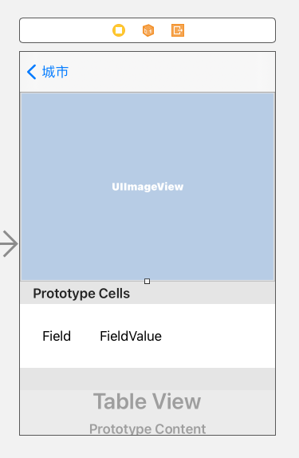

# 自訂細節頁面
1. 建立City class,將Citys陣列改為儲存City
2. 建立功能更完善的DetailViewController
3. 自訂TableView外觀
4. 自訂NavigationBar 的外觀

## 1.建立City class,將Citys陣列改為儲存City

```swift
import Foundation
class City{
    var city:String!
    var continent:String!;
    var country:String!;
    var image:String!;
    var local:String!;
    var latitude:Double!;
    var longitude:Double!;
    var url:String!;
    
    init(city:String, continent:String, country:String, image:String, local:String, lat latitude:Double, lon longitude:Double,url:String){
        self.city = city;
        self.continent = continent;
        self.country = country;
        self.image = image;
        self.local = local;
        self.latitude = latitude
        self.longitude = longitude;
        self.url = url;
    }
    
    convenience init(){
        self.init(city: "", continent: "", country: "", image: "", local: "", lat: 0.0, lon: 0.0, url:"");
    }
}

```

ViewController

```swift
//
//  ViewController.swift
//  simpleTableView
//
//  Created by t1 on 2019/1/20.
//  Copyright © 2019年 gjun. All rights reserved.
//

import UIKit

class ViewController: UITableViewController {
    
    var citys = [City]();
    var cityIsMarded:[Bool]!;
    
    override func viewDidLoad() {
        super.viewDidLoad()
        let bundle = Bundle.main;
        let pathURL = bundle.url(forResource: "citylist", withExtension: "plist")!;
        if let dicCitys = NSArray(contentsOf: pathURL) as? [[String:Any]]{
            for dicCity in dicCitys{
                let city = City();
                city.city = dicCity["City"] as? String;
                city.country = dicCity["Country"] as? String;
                city.continent = dicCity["Continent"] as? String;
                city.image = dicCity["Image"] as? String;
                city.local = dicCity["Local"] as? String;
                city.url = dicCity["url"] as? String;
                city.latitude = dicCity["lat"] as? Double;
                city.longitude = dicCity["long"] as? Double;
                citys.append(city);
            }
        }
        cityIsMarded = Array(repeating: false, count: citys.count);
        
        //status bar
        
    }
    
    
    
    override func viewWillAppear(_ animated: Bool) {
        super.viewWillAppear(animated);
        navigationController?.hidesBarsOnSwipe = true;
    }
    
    override func prepare(for segue: UIStoryboardSegue, sender: Any?) {
        if segue.identifier == "showCity"{
            if let indexPath = tableView.indexPathForSelectedRow{
                let destinationController = segue.destination as! CityDetailViewController;
                let city = citys[indexPath.row];
                //destinationController.cityImageName = city.image;
                //destinationController.cityName = city.city;
                destinationController.city = city;
            }
        }
    }
    //MARK: - UITableViewDataSource
    override func tableView(_ tableView: UITableView, numberOfRowsInSection section: Int) -> Int{
        return citys.count;
    }
    
    override func tableView(_ tableView: UITableView, cellForRowAt indexPath: IndexPath) -> UITableViewCell{
        let rowIndex = indexPath.row;
        let city = citys[rowIndex];
        let cityName = city.city;
        let imageName = city.image;
        let countryName = city.country;
        let continentName = city.continent;
        let cell = tableView.dequeueReusableCell(withIdentifier: "CELL", for: indexPath) as! CityCell;
        cell.cityLabel.text = cityName;
        cell.countryLabel.text = countryName;
        cell.continentLabel.text = continentName;
        cell.cityImageView.image = UIImage(named: imageName!);
        if cityIsMarded[rowIndex]{
            cell.accessoryType = .checkmark;
        }else{
            cell.accessoryType = .none;
        }
        return cell;
    }
    
    override func tableView(_ tableView: UITableView, commit editingStyle: UITableViewCell.EditingStyle, forRowAt indexPath: IndexPath){
        if editingStyle == .delete{
            citys.remove(at: indexPath.row);
            cityIsMarded.remove(at: indexPath.row);
            print("total item:\(citys.count)");
            tableView.deleteRows(at: [indexPath], with: .automatic);
        }
    }

    //MARK: - UITableViewDelegate
    /*
    override func tableView(_ tableView: UITableView, didSelectRowAt indexPath: IndexPath){
        //建立一個action sheet的選項按鈕
        let optionMenu = UIAlertController(title: nil, message: "您想要做什麼?", preferredStyle: .actionSheet);
        //在action sheet內建立一個按鈕
        let cancelAction = UIAlertAction(title: "取消", style: .cancel, handler: nil);
        optionMenu.addAction(cancelAction);
        
        //在actionSheet內建立一個call-action
        let callAction = UIAlertAction(title: "聯絡旅行社", style: .default, handler: {
            (action:UIAlertAction!)->Void in
            let alertMessage = UIAlertController(title: "連線失敗", message: "目前正在忙線中", preferredStyle: .alert);
            alertMessage.addAction(UIAlertAction(title: "OK", style: .default, handler: nil));
            self.present(alertMessage, animated: true, completion: nil);
        })
        
        optionMenu.addAction(callAction);
        
        //增加標示選項
        var titleName:String!;
        if self.cityIsMarded[indexPath.row]{
            titleName = "取消標示"
        }else{
            titleName = "標示"
        }
        
        let checkInMark = UIAlertAction(title: titleName, style: .default, handler: {
            (action:UIAlertAction) -> Void in
            let cell = tableView.cellForRow(at: indexPath);
            switch titleName{
            case "取消標示":
                cell?.accessoryType = .none;
                self.cityIsMarded[indexPath.row] = false;
            case "標示":
                cell?.accessoryType = .checkmark
                self.cityIsMarded[indexPath.row] = true;
            default:
                break;
            }
            
        })
        
        optionMenu.addAction(checkInMark);
        
        //顯示選項
        present(optionMenu, animated: true, completion: nil);
    }
 */
    
    override func tableView(_ tableView: UITableView, editActionsForRowAt indexPath: IndexPath) -> [UITableViewRowAction]?{
        let shareAction = UITableViewRowAction(style: .default, title: "分享", handler: {
            (action:UITableViewRowAction, indexPath:IndexPath) -> Void in
            let defaultText = "直接打電話給" + (self.citys[indexPath.row].city);
            let activityController = UIActivityViewController(activityItems: [defaultText], applicationActivities: nil);
            self.present(activityController, animated: true, completion: nil)
        })
        
        let deleteAction = UITableViewRowAction(style: .default, title: "刪除", handler: {
            (action:UITableViewRowAction, indexPath:IndexPath) -> Void in
            self.citys.remove(at: indexPath.row);
            self.cityIsMarded.remove(at: indexPath.row);
            print("total item:\(self.citys.count)");
            tableView.deleteRows(at: [indexPath], with: .automatic);
        })
        
        shareAction.backgroundColor = UIColor(red: 48.0/255.0, green: 173.0/255.0, blue: 99.0/255.0, alpha: 1.0);
        deleteAction.backgroundColor = UIColor(red: 202.0/255.0, green: 202.0/255.0, blue: 202.0/255.0, alpha: 1.0);
        
        return [shareAction, deleteAction];
    }
 
}


```

CityCell

```swift
import UIKit

class CityCell: UITableViewCell {
    @IBOutlet var cityLabel:UILabel!;
    @IBOutlet var countryLabel:UILabel!;
    @IBOutlet var continentLabel:UILabel!;
    @IBOutlet var cityImageView:UIImageView!;
    
    override func awakeFromNib() {
        super.awakeFromNib()
        // Initialization code
    }

    override func setSelected(_ selected: Bool, animated: Bool) {
        super.setSelected(selected, animated: animated)

        // Configure the view for the selected state
    }

}

```

## 建立功能更完善的DetailViewController



DetailViewCell

```swift
//
//  DetailViewCell.swift
//  Detail
//
//  Created by Robert on 2019/2/8.
//  Copyright © 2019 gjun. All rights reserved.
//

import UIKit

class DetailViewCell: UITableViewCell {
    @IBOutlet var fieldLabel:UILabel!;
    @IBOutlet var valueLabel:UILabel!;
    
    override func awakeFromNib() {
        super.awakeFromNib()
        // Initialization code
    }

    override func setSelected(_ selected: Bool, animated: Bool) {
        super.setSelected(selected, animated: animated)

        // Configure the view for the selected state
    }

}

```

```swift
//
//  CityDetailViewController.swift
//  Navigation
//
//  Created by Robert on 2019/2/6.
//  Copyright © 2019 gjun. All rights reserved.
//

import UIKit

class CityDetailViewController: UIViewController {
    @IBOutlet var cityImageView:UIImageView!;
    @IBOutlet var tableView:UITableView!;
    //var cityImageName:String?;
    //var cityName:String?;
    var city:City?;
    
    override func viewDidLoad() {
        super.viewDidLoad()

        cityImageView.image = UIImage(named: city?.image ?? "");
        title = city?.city;
        
        //change table appearance
        tableView.backgroundColor = UIColor(red: 240.0/255.0, green: 240.0/255.0, blue: 240.0/255.0, alpha: 0.2);
        tableView.tableFooterView = UIView(frame: CGRect.zero);
        tableView.separatorColor = UIColor(red: 240.0/255.0, green: 240.0/255.0, blue: 240.0/255.0, alpha: 0.6);
        
        
    }
    
    override func viewWillAppear(_ animated: Bool) {
        super.viewWillAppear(animated);
        navigationController?.hidesBarsOnSwipe = false;
        navigationController?.setNavigationBarHidden(false, animated: true);
    }
    

    
}
extension CityDetailViewController:UITableViewDataSource{
    func tableView(_ tableView: UITableView, numberOfRowsInSection section: Int) -> Int{
        return 4;
    }
    
    func tableView(_ tableView: UITableView, cellForRowAt indexPath: IndexPath) -> UITableViewCell{
        let cell = tableView.dequeueReusableCell(withIdentifier: "CELL", for: indexPath) as! DetailViewCell;
        cell.backgroundColor = UIColor.clear;
        switch indexPath.row{
        case 0:
            cell.fieldLabel.text = "城市"
            cell.valueLabel.text = city?.city;
        case 1:
            cell.fieldLabel.text = "國家"
            cell.valueLabel.text = city?.country;
        case 2:
            cell.fieldLabel.text = "洲"
            cell.valueLabel.text = city?.continent;
        case 3:
            cell.fieldLabel.text = "網址"
            cell.valueLabel.text = city?.url;
        default:
            cell.fieldLabel.text = "";
            cell.valueLabel.text = "";
            
        }
        return cell;
    }
}

```