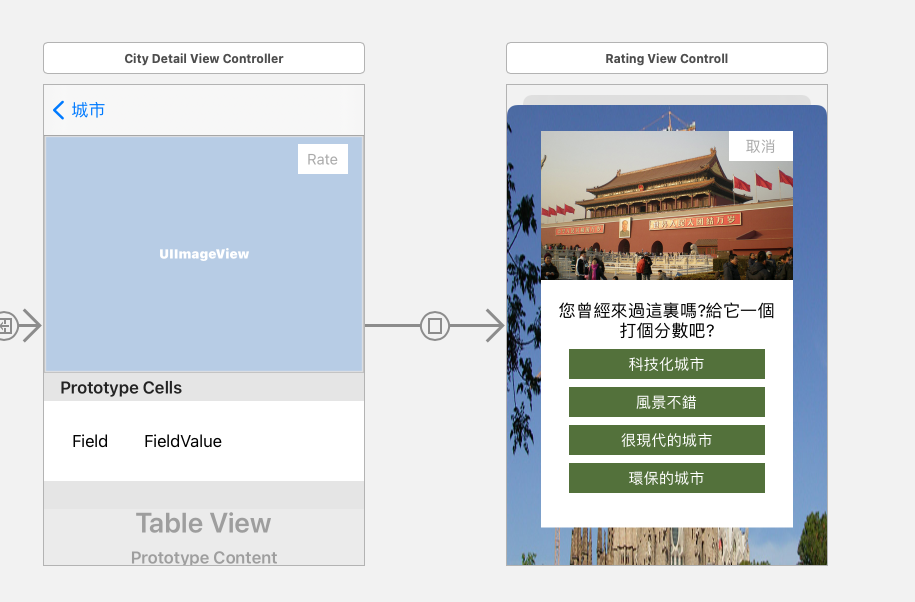
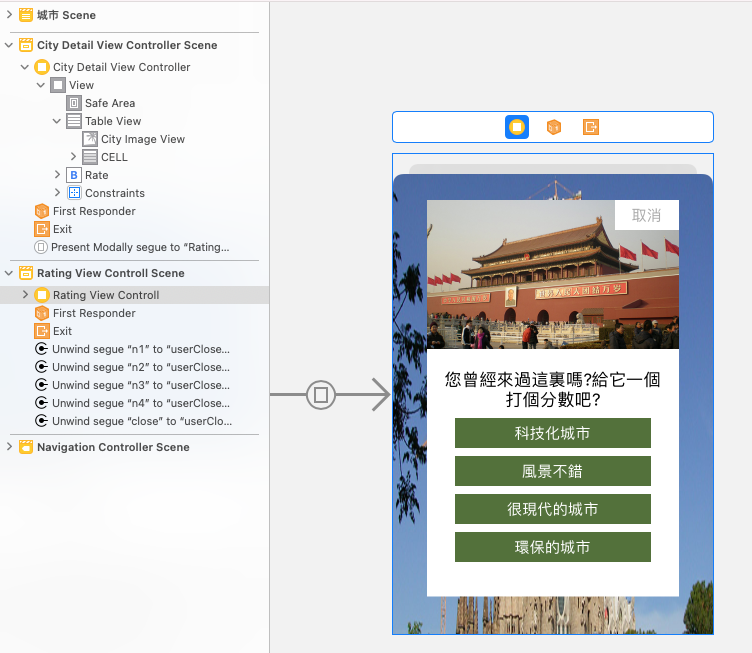

# 基本動畫
1. 建立RatingViewController
2. 建立內部layout
3. 使用UIView建立簡易動畫
4. 使用unwindSegue退出modelView
5. 更新City類別屬性userRate資料





## 建立RatingViewController

```
//
//  RatingViewControll.swift
//  Animation
//
//  Created by Robert on 2019/2/8.
//  Copyright © 2019 gjun. All rights reserved.
//

import UIKit

class RatingViewControll: UIViewController {
    @IBOutlet var backgroundImageView:UIImageView!;
    @IBOutlet var askLabel:UILabel!;
    @IBOutlet var containerView:UIView!;
    
    override func viewDidLoad() {
        super.viewDidLoad()
        let blurEffect = UIBlurEffect(style: .dark);
        let blurEffectView = UIVisualEffectView(effect: blurEffect);
        blurEffectView.frame = view.bounds;
        backgroundImageView.addSubview(blurEffectView);
        askLabel.text = "您曾經來過這裏嗎?\n給這個城市一個描素吧!";
        
        containerView.transform = CGAffineTransform.init(scaleX: 0, y: 0);
    }
    
    override func viewDidAppear(_ animated: Bool) {
        super.viewDidAppear(animated);
        UIView.animate(withDuration: 0.3, animations: {
            self.containerView.transform = CGAffineTransform.identity;
        })
    }

    

}

```

City

```swift
import Foundation
class City{
    var city:String!
    var continent:String!;
    var country:String!;
    var image:String!;
    var local:String!;
    var latitude:Double!;
    var longitude:Double!;
    var url:String!;
    var userRate:String!;
    
    init(city:String, continent:String, country:String, image:String, local:String, lat latitude:Double, lon longitude:Double,url:String,userRate:String = ""){
        self.city = city;
        self.continent = continent;
        self.country = country;
        self.image = image;
        self.local = local;
        self.latitude = latitude
        self.longitude = longitude;
        self.url = url;
        self.userRate = userRate;
    }
    
    convenience init(){
        self.init(city: "", continent: "", country: "", image: "", local: "", lat: 0.0, lon: 0.0, url:"");
    }
}

```

CityDetailViewController

```swift
class CityDetailViewController: UIViewController {
    @IBOutlet var cityImageView:UIImageView!;
    @IBOutlet var tableView:UITableView!;
    //var cityImageName:String?;
    //var cityName:String?;
    var city:City?;
    
    override func viewDidLoad() {
        super.viewDidLoad()

        cityImageView.image = UIImage(named: city?.image ?? "");
        title = city?.city;
        
        //change table appearance
        tableView.backgroundColor = UIColor(red: 240.0/255.0, green: 240.0/255.0, blue: 240.0/255.0, alpha: 0.2);
        tableView.tableFooterView = UIView(frame: CGRect.zero);
        tableView.separatorColor = UIColor(red: 240.0/255.0, green: 240.0/255.0, blue: 240.0/255.0, alpha: 0.6);
        
        
        //設定cell為自動調整高度
        tableView.estimatedRowHeight = 38.0;
        tableView.rowHeight = UITableView.automaticDimension;
        
    }
    
    override func viewWillAppear(_ animated: Bool) {
        super.viewWillAppear(animated);
        navigationController?.hidesBarsOnSwipe = false;
        navigationController?.setNavigationBarHidden(false, animated: true);
    }
    
    
    
    //加入    
    @IBAction func userClose(segue:UIStoryboardSegue){
        if let userRating = segue.identifier{
            switch userRating{
            case "n1":
                city?.userRate = "科技化城市";
                tableView.reloadData()
            case "n2":
                city?.userRate = "風景不錯";
                tableView.reloadData()
            case "n3":
                city?.userRate = "很現代的城市";
                tableView.reloadData()
            case "n4":
                city?.userRate = "環保的城市";
                tableView.reloadData()
            default:
                break;
            }
        }
        
        
        
        
    }
    

    
}
extension CityDetailViewController:UITableViewDataSource{
    func tableView(_ tableView: UITableView, numberOfRowsInSection section: Int) -> Int{
        return 6;
    }
    
    func tableView(_ tableView: UITableView, cellForRowAt indexPath: IndexPath) -> UITableViewCell{
        let cell = tableView.dequeueReusableCell(withIdentifier: "CELL", for: indexPath) as! DetailViewCell;
        cell.backgroundColor = UIColor.clear;
        switch indexPath.row{
        case 0:
            cell.fieldLabel.text = "城市"
            cell.valueLabel.text = city?.city;
        case 1:
            cell.fieldLabel.text = "國家"
            cell.valueLabel.text = city?.country;
        case 2:
            cell.fieldLabel.text = "洲"
            cell.valueLabel.text = city?.continent;
        case 3:
            cell.fieldLabel.text = "網址"
            cell.valueLabel.text = city?.url;
            
            
        //加入
        case 4:
            cell.fieldLabel.text = "描繪"
            if city?.userRate == ""{
                cell.valueLabel.text = "目前無資料";
            }else{
                cell.valueLabel.text = city?.userRate;
            }
            
        case 5:
            cell.fieldLabel.text = "簡介"
            cell.valueLabel.text = city?.local;
        default:
            cell.fieldLabel.text = "";
            cell.valueLabel.text = "";
            
        }
        return cell;
    }
}

```